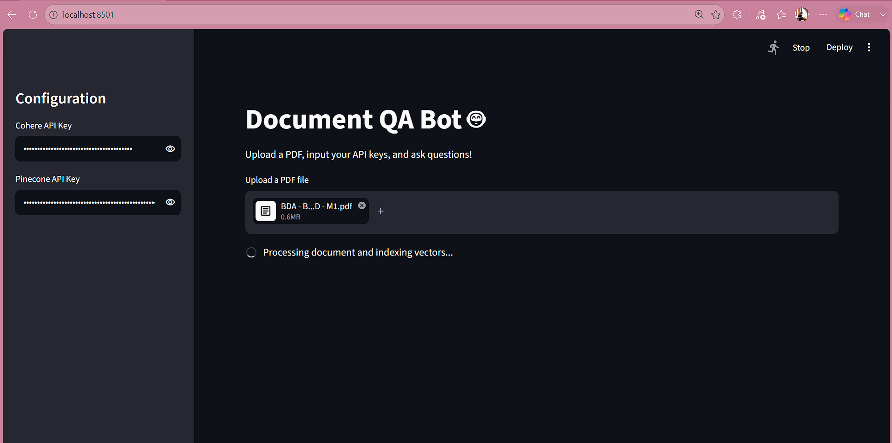
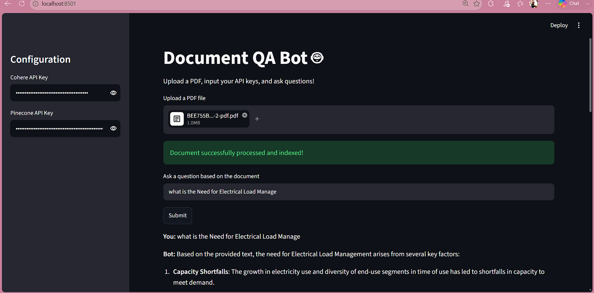
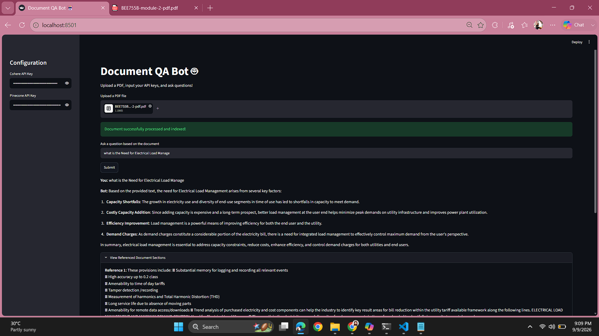

# Document-QA-Bot

A Retrieval-Augmented Generation (RAG) chatbot that answers questions from uploaded PDFs using **Cohere V2** and **Pinecone**.  
Built with **Streamlit** for a simple UI.

---

## 🚀 Features
- 📂 Upload any PDF and ask questions
- 🧠 Uses Cohere V2 (`command-a-plus-05-2026`) for responses
- 🔍 Vector search powered by Pinecone
- 🎨 Streamlit interface for easy interaction

---

## 🛠️ Setup Instructions

### 1. Clone the Repository
bash
git clone https://github.com/ankitha567/Document-QA-Bot.git
cd Document-QA-Bot
pip install -r requirements.txt
streamlit run app.py

